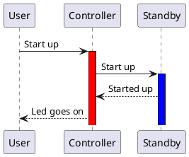

# Sequence diagram calling
The following sequence diagram shows the calling of the function by the tasks

Function call voorbeeld:

Elevator ask to controller: Open door
Controller returned: Doors open

