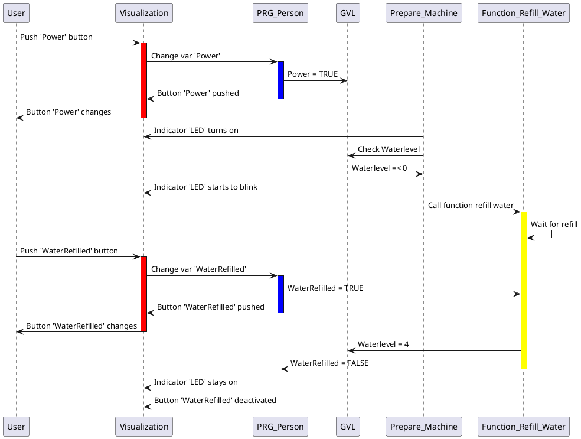

# Sequence diagram calling
The following sequence diagram shows the calling of the function by the tasks

```plantuml
@startuml

User -> Visualization: Push 'Power' button
activate Visualization #RED
Visualization -> PRG_Person: Change var 'Power'
activate PRG_Person #BLUE
PRG_Person -> GVL: Power = TRUE
PRG_Person --> Visualization: Button 'Power' pushed
deactivate PRG_Person 
Visualization --> User: Button 'Power' changes
deactivate Visualization 
Prepare_Machine -> Visualization: Indicator 'LED' turns on

Prepare_Machine -> GVL: Check Waterlevel
GVL --> Prepare_Machine: Waterlevel =< 0
Prepare_Machine -> Visualization: Indicator 'LED' starts to blink 
Prepare_Machine -> Function_Refill_Water: Call function refill water
activate Function_Refill_Water #YELLOW
Function_Refill_Water -> Function_Refill_Water: Wait for refill


User -> Visualization: Push 'WaterRefilled' button
activate Visualization #RED
Visualization -> PRG_Person: Change var 'WaterRefilled'
activate PRG_Person #BLUE
PRG_Person -> Function_Refill_Water: WaterRefilled = TRUE
PRG_Person -> Visualization: Button 'WaterRefilled' pushed
deactivate PRG_Person 
Visualization -> User: Button 'WaterRefilled' changes
deactivate Visualization
Function_Refill_Water -> GVL: Waterlevel = 4
Function_Refill_Water -> PRG_Person: WaterRefilled = FALSE
deactivate Function_Refill_Water
Prepare_Machine -> Visualization: Indicator 'LED' stays on
PRG_Person -> Visualization: Button 'WaterRefilled' deactivated

@enduml
```