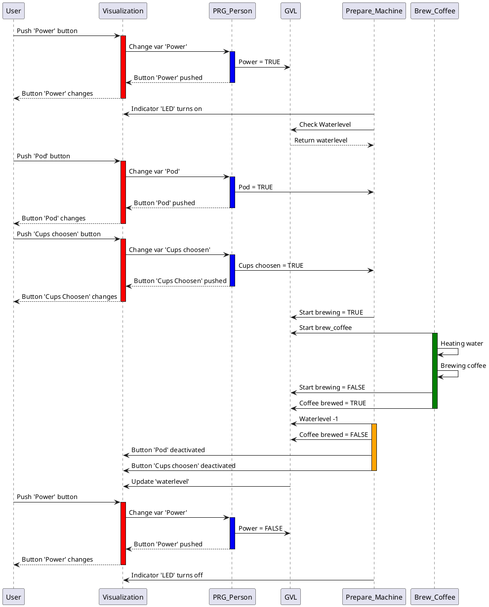

# Sequence diagram communication
The following sequence diagram shows the communicating between the tasks, user and visualization
- User = the real person who uses the coffee machine
- PRG_Person = the programmed person 

