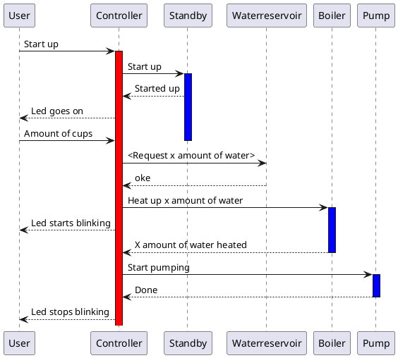

# Sequence diagram communication
The following sequence diagram shows the communicating between the tasks

```plantuml
@startuml
participant User

User -> Controller: Start up 
activate Controller #RED
Controller -> Standby: Start up
activate Standby #BLUE
Standby --> Controller: Started up
Controller --> User: Led goes on


User -> Controller: Amount of cups
deactivate Standby
Controller -> Waterreservoir: <Request x amount of water>
Waterreservoir --> Controller: oke

Controller -> Boiler: Heat up x amount of water
activate Boiler #BLUE
Controller --> User: Led starts blinking 
Boiler --> Controller: X amount of water heated
deactivate Boiler
Controller -> Pump: Start pumping
activate Pump #BLUE
Pump --> Controller: Done
deactivate Pump

Controller --> User: Led stops blinking

@enduml
```
