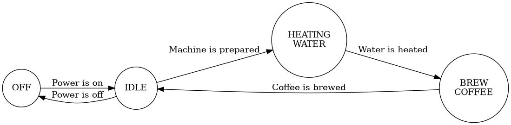

# State diagram brew coffee
The following state diagram describes the states of the task brewing coffee

```plantuml
@startdot
digraph State{

graph [bgcolor="white"] 

rankdir="LR";
node[shape="circle"]

OFF
IDLE
HEATING_WATER [label="HEATING\nWATER"]
BREW_COFFEE [label="BREW\nCOFFEE"]

OFF -> IDLE [label="Power is on"]
IDLE -> HEATING_WATER [label="Machine is prepared"]
HEATING_WATER -> BREW_COFFEE [label="Water is heated"]
BREW_COFFEE -> IDLE [label="Coffee is brewed"]
IDLE -> OFF [label="Power is off"]


}
@enddot
```