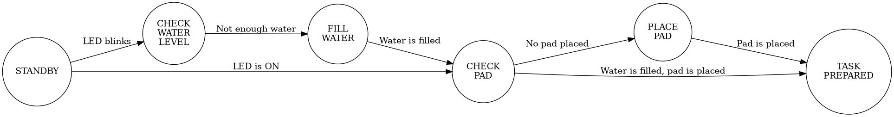

# State diagram preparing machine
The following state diagram describes the states of the task preparing of the machine

```plantuml
@startdot
digraph State{

graph [bgcolor="white"] 

rankdir="LR";
node[shape="circle"]

STANDBY
CHECK_WATER_LEVEL [label="CHECK\nWATER\nLEVEL"]
FILL_WATER  [label="FILL\nWATER"]
CHECK_PAD [label="CHECK\nPAD"]
PLACE_PAD [label="PLACE\nPAD"]
TASK_PREPARED [label="TASK\nPREPARED"]

 
STANDBY -> CHECK_WATER_LEVEL [label="LED blinks"]
STANDBY -> CHECK_PAD [label="LED is ON"]   
CHECK_WATER_LEVEL -> FILL_WATER [label="Not enough water"]
FILL_WATER -> CHECK_PAD [label="Water is filled"]
CHECK_PAD -> PLACE_PAD [label="No pad placed"]
PLACE_PAD -> TASK_PREPARED [label="Pad is placed"]
CHECK_PAD -> TASK_PREPARED [label="Water is filled, pad is placed"]

}
@enddot
```