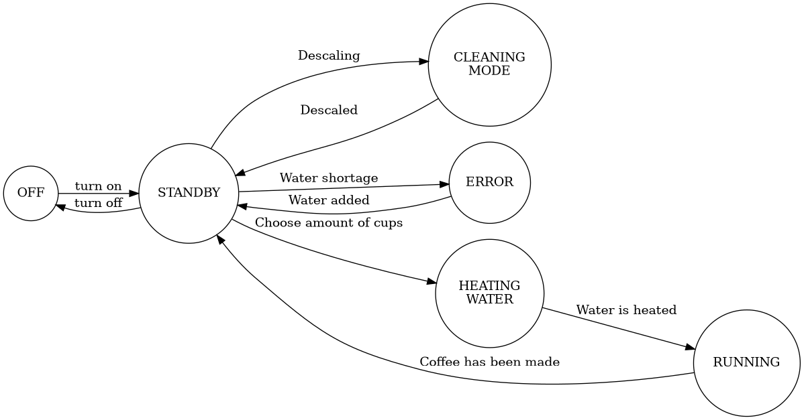

# State diagram starting coffee process

The following state diagram describes the states of the task starting the coffee process

```plantuml
@startdot
digraph State{

graph [bgcolor="white"] 

rankdir="LR";
node[shape="circle"]

OFF 
CLEANING_MODE [label="CLEANING\nMODE"]
ERROR
STANDBY
HEATING_WATER [label="HEATING\nWATER"]
RUNNING
 
OFF -> STANDBY [label="turn on"]
STANDBY -> OFF [label="turn off"]
STANDBY -> HEATING_WATER [label="Choose amount of cups"]
HEATING_WATER -> RUNNING [label="Water is heated"]
RUNNING -> STANDBY [label="Coffee has been made"]
STANDBY -> ERROR [label="Water shortage"]
ERROR -> STANDBY [label="Water added"]
STANDBY -> CLEANING_MODE [label="Descaling"]
CLEANING_MODE -> STANDBY [label="Descaled"]

}
@enddot
```